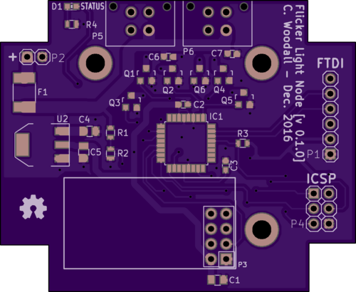
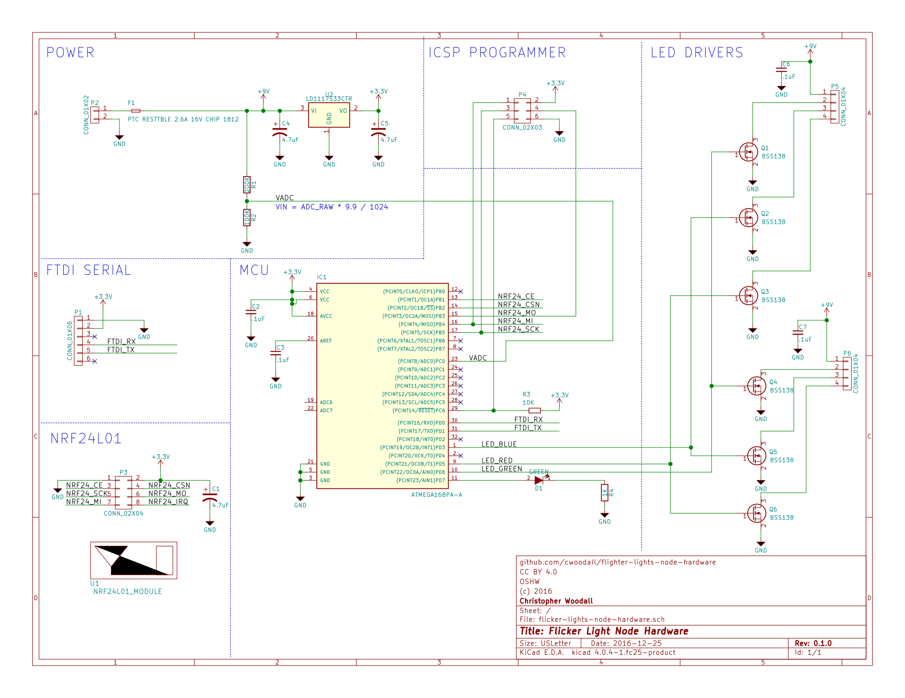

# History

## 0.1.0 (2016-12-27)

- Initial release of flicker-lights-node-hardware.
- Completed rev 0.1.0 PCB.
- Completed rev 0.1.0 Schematic.
- Added a BOM generation script.

### Order Information

**WARNING: THIS HAS NOT BEEN TESTED YET ORDER AT YOUR OWN RISK**

<a href="https://oshpark.com/shared_projects/M30of3XY"></img></a>
- [Digikey Cart](http://www.digikey.com/short/3r7ztf)

### PCB Preview

### Schematic

