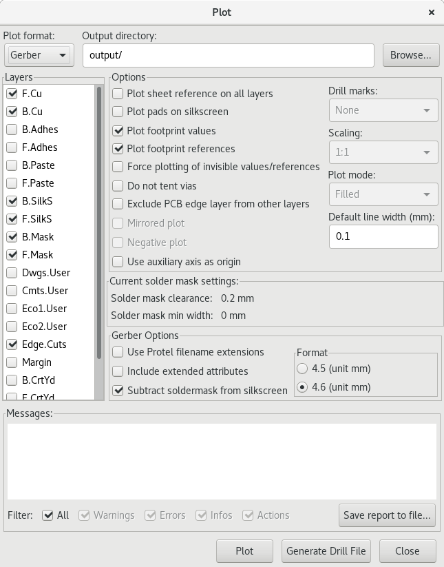
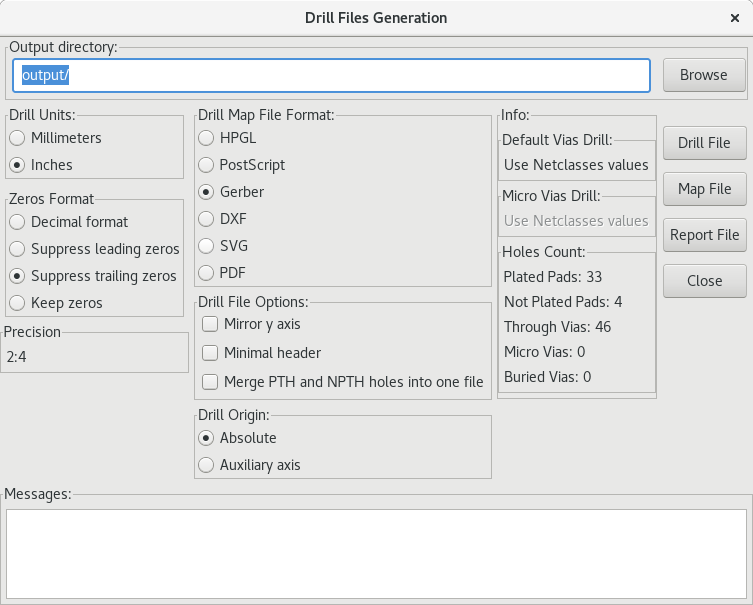

# Usage

## Requirements

- [KiCad (v4.0.0+)](http://kicad-pcb.org/download/)
- [Python 2.7](https://www.python.org/) (For Scripts) with:
  -  BeautifulSoup (`$ pip install BeautifulSoup`)

## Using

To use Flicker Light Node Hardware, just clone it and modify it to your heart's content:

    $ git clone https://github.com/cwoodall/flighter-lights-node-hardware.git

## Generating A Bill Of Materials

From `eeschema` with the schematic file open:

1. `Tools >> Generate Bill Of Materials`
2. Press `Add Plugin` then add `scripts/genbom.py`
3. Change the command line info to:

   `python "%P/../scripts/genbom.py" "%I" "%O-bom.csv"`
4. Press `Generate` the bill of materials will now be in the file flighter-lights-node-hardware-bom.csv

## Generating Gerbers

From `pcbnew` with the pcb file open:

1. `File >> Plot`
2. Make the settings match:
   

3. Press `Plot`
4. Press `Generate Drill File`
   

5. Press `Drill File`
6. Your outputs will be in the `output` folder

### To order from OSHPark

1. Upload the `.kicad_pcb` file.
